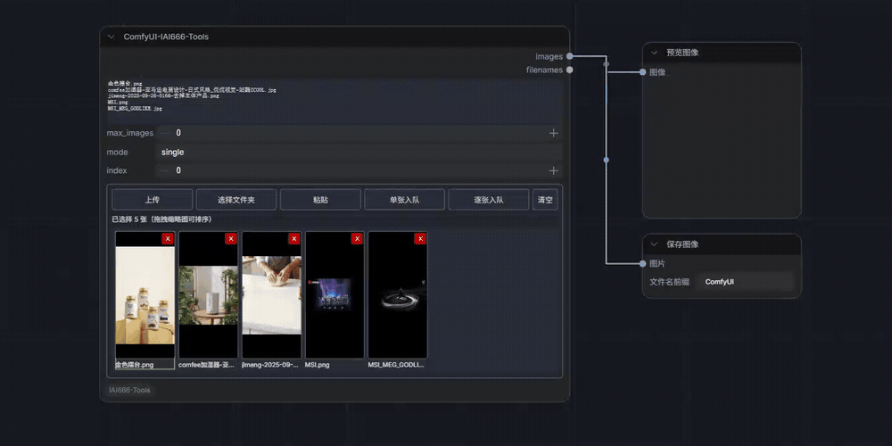
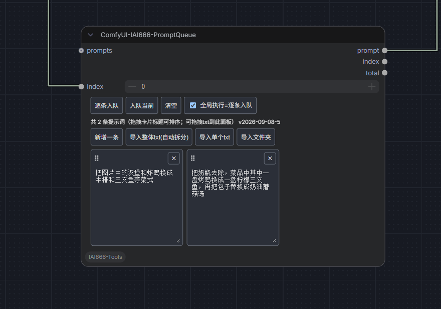

# ComfyUI-IAI666-Tools ✨

一个用于管理批量图片与提示词、按索引逐项输出并创建生成队列的 ComfyUI 自定义节点集合。

---

## 🌟 功能特性
- **批量提示词节点**：支持批量加载/处理提示词，避免重复操作
- **批量图片节点**：支持图片预览、排序、按索引输出及队列总数统计
- **任务队列管理**：创建多个生成任务，按顺序逐个执行
- **逐一生成结果**：执行时依次生成每张图片，便于调试和结果管理
- **前端界面集成**：提供简洁的 Web 界面，方便查看任务队列和进度

## 🖼️ 节点预览

### ComfyUI-IAI666-ImageQueue

<p align="center">
  
</p>

### ComfyUI-IAI666-PromptQueue

<p align="center">
  
</p>

---

## 📦 本次更新（v1.2.0，相较 v1.1.0）

本次更新同时优化图片队列和提示词队列，并修复动态索引在工作流验证阶段可能触发的异常。

### 🖼️ 图片队列

- 节点显示名称调整为 `ComfyUI-IAI666-ImageQueue`，内部类型仍保留 `BatchLoadImages`，兼容已有工作流
- 新增 `total` 整数输出，返回应用 `max_images` 后的图片队列总数；`single` 模式仍会返回完整队列数量
- 图片排序支持直接拖拽整张图片卡片，不再显示额外的 `⠿` 拖拽柄
- 目标卡片左侧或右侧会显示贯穿卡片高度的绿色竖条；排序或删除后，当前 `index` 会继续跟随原先选中的图片

### 📝 提示词队列

- 修复动态连接的 `index` 在验证阶段为 `None` 时引发的 `NoneType` 与整数比较异常
- 修复加载工作流时提示词卡片偶发显示为 0 条、交互后才重新出现的问题
- 提示词编辑区随节点宽高自适应，卡片会自动换列，输入框支持纵向拖动调整长度
- 每条提示词使用单一外框，拖拽 `⠿` 可调整顺序，`×` 用于删除；顺序会持久保存到工作流
- 排序或删除提示词后，当前 `index` 会尽量继续指向原先选中的提示词

### 🔄 兼容性

- `BatchLoadImages` 内部节点类型未更改，已有工作流无需替换节点
- `images` 和 `filenames` 仍是前两个输出，新增的 `total` 追加在第三个输出位置

### ⬆️ 更新后操作

本次同时修改了 Python 节点接口和前端脚本。更新文件后请完整重启 ComfyUI 后端，再在浏览器中按 `Ctrl+F5` 强制刷新，以确保新输出端口和新版界面同时生效。

---

## 📦 本次更新（v1.1.0，相较 v1.0.1）

本次更新集中优化 `BatchLoadImages` 的前端图片管理体验，Python 节点接口和工作流连接保持不变。

### ✨ 新增功能

- 新增“粘贴”按钮，可直接读取剪贴板图片并上传
- 支持拖拽缩略图调整顺序，新顺序会同步保存到 `image_list`
- 支持单击缩略图选中图片，并将对应位置同步到 `index`
- 选中图片经过排序或删除后，`index` 会自动跟随调整

### 🎛️ 交互与布局调整

- 工具栏统一为纯文字按钮：上传、选择文件夹、粘贴、单张入队、逐张入队、清空
- “上传”和“选择文件夹”由替换列表改为默认追加，避免覆盖已导入并排好顺序的图片
- 图片网格自动占满节点剩余空间，并随节点宽高变化自适应
- 缩略图改为完整适配显示，避免不同宽高比的图片被裁切
- 工具栏空间不足时自动换行，改善窄节点下的显示效果

### ⚡ 性能优化

- 缩略图启用懒加载和异步解码，降低大量图片同时显示时的资源占用
- 减少上传、粘贴、排序和删除后的重复重绘

### 🔄 兼容性

- 保持 `image_list`、`max_images`、`mode`、`index` 参数及输出接口不变，现有工作流无需重新连线

---

## 📦 本次更新（v1.0.1 by numibuc144-afk）

### 🔧 修复内容
- **修复 None 值崩溃问题**：`VALIDATE_INPUTS`、`load_images`、`IS_CHANGED` 方法中 `index` 参数为 `None` 时会导致类型比较崩溃（`'<' not supported between instances of 'NoneType' and 'int'`）
- **增强循环节点兼容性**：现在可以与 `comfyui-easy-use` 的 For/While 循环节点完美配合使用

### 🎯 问题场景
当 `BatchLoadImages` 节点放在 For 循环内部时，ComfyUI 在验证阶段会传入 `None` 值给 `index` 参数，导致验证失败，工作流无法运行。

### ✅ 修复方案
在三个方法开头添加 None 值保护：
```python
if index is None:
    index = 0
```

## 📦 包含节点

| 节点名称 | 功能 |
|----------|------|
| **ComfyUI-IAI666-ImageQueue**（内部类型 `BatchLoadImages`） | 批量加载图片，支持预览排序、按索引输出及队列总数统计 |
| **PromptQueue** | 提示词队列，按索引提取提示词 |
| **IAI666_TextList** | 文本列表组合（最多4个输入合并） |
| **IAI666_SplitLines** | 文本按行分割 |

## 🚀 安装方法

### 方法一：手动安装

1. 下载本仓库
2. 将文件夹放入 `ComfyUI/custom_nodes/` 目录
3. 重启 ComfyUI

### 方法二：ComfyUI Manager

1. 打开 ComfyUI Manager
2. 搜索 `IAI666-Tools`
3. 点击安装

## 📖 节点说明

### 1. ComfyUI-IAI666-ImageQueue（内部类型 BatchLoadImages）

从文件名列表中加载图片，支持批量或按索引加载单张。

**输入参数：**

| 参数 | 类型 | 默认值 | 说明 |
|------|------|--------|------|
| `image_list` | STRING | "" | 图片文件名列表，每行一个 |
| `max_images` | INT | 0 | 最大加载数量（0=不限制） |
| `mode` | batch/single | batch | batch=批量加载，single=按索引加载 |
| `index` | INT | 0 | single模式下加载第几张（从0开始） |

**前端操作：**

- “上传”和“选择文件夹”会把图片追加到现有队列
- “粘贴”可读取剪贴板图片并上传到 ComfyUI
- 单击图片卡片会把该图片位置同步到 `index`
- 拖拽整张图片卡片可调整顺序；目标卡片左侧或右侧的绿色竖条表示插入位置
- 红色 `×` 删除图片；排序或删除后，当前 `index` 会尽量继续指向原先选中的图片
- “单张入队”执行当前索引，“逐张入队”按队列顺序逐项执行

**输出：**

| 输出 | 类型 | 说明 |
|------|------|------|
| `images` | IMAGE | 加载的图片 tensor |
| `filenames` | STRING | 实际加载的图片文件名 |
| `total` | INT | 应用 `max_images` 后的图片队列总数；`single` 模式仍返回完整队列数量 |

**使用示例：**

```
image_list:
上架图-6_0001.png
上架图-7_0001.png
上架图-8_0002.png
上架图-9_0001.png

mode: single
index: 0  →  输出上架图-6_0001.png
index: 1  →  输出上架图-7_0001.png
index: 2  →  输出上架图-8_0002.png
index: 3  →  输出上架图-9_0001.png
```

以上队列在 `max_images: 0` 时，`total` 输出为 `4`；如果设置 `max_images: 2`，则 `total` 输出为 `2`。

---

### 2. PromptQueue（提示词队列）

从 JSON 数组或上游输入中按索引提取一条提示词。

**输入参数：**

| 参数 | 类型 | 默认值 | 说明 |
|------|------|--------|------|
| `prompts_json` | STRING | [] | 提示词 JSON 数组（隐藏参数） |
| `index` | INT | 0 | 提取第几条（从0开始） |
| `prompts` | STRING | (可选) | 上游直接传入提示词列表 |

**前端操作：**

- 支持新增提示词，以及导入整份 TXT、单个 TXT 或 TXT 文件夹
- 拖拽卡片标题中的 `⠿` 可调整提示词顺序，`×` 删除当前提示词
- 输入框可纵向拖动改变高度；卡片会根据节点宽度自动换列
- “入队当前”只执行当前索引，“逐条入队”按提示词顺序执行全部非空项目
- “全局执行=逐条入队”启用时，全局运行按钮会触发提示词逐条入队；同一工作流只应启用一个 PromptQueue

**输出：**

| 输出 | 类型 | 说明 |
|------|------|------|
| `prompt` | STRING | 当前索引的提示词 |
| `index` | INT | 当前索引 |
| `total` | INT | 提示词总数 |

**使用示例：**

```json
prompts_json: ["a beautiful sunset", "a cute cat", "a mountain landscape"]

index: 0  →  "a beautiful sunset"
index: 1  →  "a cute cat"
index: 2  →  "a mountain landscape"
```

---

### 3. IAI666_TextList（文本列表组合）

将最多 4 个文本输入合并成一个列表。

**输入参数：**

| 参数 | 类型 | 说明 |
|------|------|------|
| `text1` | STRING | 文本输入1（可选） |
| `text2` | STRING | 文本输入2（可选） |
| `text3` | STRING | 文本输入3（可选） |
| `text4` | STRING | 文本输入4（可选） |

**输出：**

| 输出 | 类型 | 说明 |
|------|------|------|
| `texts` | STRING[] | 合并后的文本列表 |

---

### 4. IAI666_SplitLines（文本分割行）

将一段文本按行分割成列表。

**输入参数：**

| 参数 | 类型 | 默认值 | 说明 |
|------|------|--------|------|
| `text` | STRING | - | 要分割的文本 |
| `ignore_empty` | BOOLEAN | true | 是否忽略空行 |
| `trim` | BOOLEAN | true | 是否去除首尾空格 |
| `split_escaped_newline` | BOOLEAN | true | 是否把 `\n` 当作换行 |
| `split_html_br` | BOOLEAN | true | 是否把 `<br>` 当作换行 |

**输出：**

| 输出 | 类型 | 说明 |
|------|------|------|
| `texts` | STRING[] | 分割后的文本列表 |

## 🔗 典型工作流

### 批量循环处理图片

```
ForLoopStart(总量=4)
    ↓
ComfyUI-IAI666-ImageQueue(mode=single, index=循环索引)
    ↓
Image Save
    ↓
ForLoopEnd
```

### 图片与提示词一对一处理

将同一个循环整数同时连接到 ImageQueue 和 PromptQueue 的 `index`：

```text
循环索引 ─┬─→ ImageQueue.index  （图片 0、1、2…）
          └─→ PromptQueue.index （提示词 0、1、2…）
```

这样每次循环会得到“图片 0 + 提示词 0、图片 1 + 提示词 1……”的对应关系。PromptQueue 的“全局执行=逐条入队”只负责展开提示词任务，不能代替外部循环同步推进 ImageQueue。

### 批量循环处理提示词

```
SplitLines(提示词列表)
    ↓
PromptQueue(index=循环索引)
    ↓
KSampler(生成图片)
    ↓
ForLoopEnd
```

## ⚠️ 注意事项

1. **图片文件名**：`image_list` 中的文件名需要是 ComfyUI 能识别的路径（通常是 `input/` 目录下的相对路径）
2. **索引从0开始**：所有 `index` 参数都是从 0 开始计数
3. **循环节点兼容**：本节点支持与 `comfyui-easy-use` 的 For/While 循环节点配合使用
4. **队列长度**：一对一循环时，建议使用两个节点 `total` 输出中的较小值作为循环次数，避免较短队列提前到达末尾

## 📝 更新日志

### v1.2.0（by numibuc144-afk）
- 图片节点显示名称调整为 `ComfyUI-IAI666-ImageQueue`，并新增 `total` 队列总数输出
- 图片排序支持整卡拖拽，并使用贯穿目标卡片高度的绿色竖条显示插入位置
- 修复 PromptQueue 动态 `index=None` 导致的工作流验证异常
- 修复 PromptQueue 初始化时偶发读取临时空值、提示词卡片需要交互后才显示的问题
- 提示词编辑区改为响应式布局，支持输入框纵向缩放和卡片拖拽排序
- 提示词卡片移除可见序号，删除按钮改为 `×`，排序与删除后同步维护当前索引

### v1.1.0（by numibuc144-afk）
- 新增剪贴板图片上传和缩略图拖拽排序
- 支持单击缩略图选择单张图片，排序或删除后自动同步 `index`
- 精简批量图片节点工具栏，上传与选择文件夹默认追加图片
- 图片网格自适应节点空间，缩略图完整显示并支持懒加载
- 减少图片列表操作后的重复重绘

### v1.0.1（by numibuc144-afk）
- 修复 `VALIDATE_INPUTS`、`load_images`、`IS_CHANGED` 方法中 `index` 参数为 `None` 时的崩溃问题
- 增强循环节点兼容性，支持与 `comfyui-easy-use` 的 For/While 循环节点配合使用

### v1.0.0（原版 by AICoser 小姐姐）
- 初始版本
- 支持 BatchLoadImages、PromptQueue、TextList、SplitLines 四个节点

## 📄 许可证

MIT License

## 🤝 贡献

欢迎提交 Issue 和 Pull Request！

## 🙏 致谢

- 感谢 B 站 UP 主 **AICoser 小姐姐** 原创节点和教学视频
- 感谢 ComfyUI 社区的支持！
